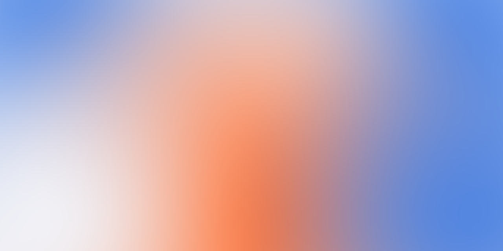

<div align="center">

# 🎨 Mesh Gradient Generator

**Create soft, blurred, multi-color mesh gradients right in your browser.**
Palette control, draggable color points, favorites, one-click PNG/JPG export.
No sign-up, no dependencies, works offline.

[](https://bifiku.github.io/mesh-gradient-generator/)
&nbsp;
[](LICENSE)
[](#)
[](https://github.com/Bifiku/mesh-gradient-generator/actions/workflows/deploy.yml)



### [→ Open the generator](https://bifiku.github.io/mesh-gradient-generator/)

</div>

---

## Features

- 🎨 **Palette** — pick your colors, add or remove (2–6), or hit **Random** for a harmonious combo (analogous, complementary, triadic, split, mono, vibrant).
- 🎲 **Generate** — one click gives a fresh random palette *and* a new blob layout. Keep tapping until you love it.
- ✋ **Draggable points** — drag the color blobs around the canvas to fine-tune the composition.
- 🎛️ **Filters** — blur, grain, brightness, contrast.
- 📐 **Canvas presets** — App Store (1320×2868), Play (1080×1920), banner (1024×500), square, 2:1, Full HD — plus custom width/height and rotate.
- 💾 **Save palettes** — store your own palettes and reapply them with a click.
- ⭐ **Favorites** — save gradients you like to a gallery (kept in your browser), reopen or download them anytime.
- ⬇️ **Export** — PNG or JPG at the exact resolution, or **SVG** (true scalable vector: radial gradients + gaussian blur, ~2 KB, editable in any vector tool).
- 🌗 **Light / dark theme** and 🌐 **EN / RU** interface.

Everything runs client-side on `<canvas>`. Nothing is uploaded anywhere.

## Use it

**Online:** just open **[bifiku.github.io/mesh-gradient-generator](https://bifiku.github.io/mesh-gradient-generator/)**.

**Locally:** it's a single self-contained file.
```bash
git clone https://github.com/Bifiku/mesh-gradient-generator.git
# then either open index.html in a browser…
# …or serve it (zero-dependency Node server on http://localhost:4321):
node serve.js
```

## How it works

A mesh gradient here is a set of soft radial color "blobs" placed on a small
off-screen canvas, upscaled and blurred into a smooth multi-color wash. The base
fill is the lightest color in the palette; each blob paints its color with a soft
radial falloff on top. Export re-renders the same state at full resolution.

Pure vanilla JS + Canvas 2D. No build step, no libraries, ~1 file.

## Notes

- Saved palettes and favorites live in your browser's **localStorage** — they're
  per-browser and never leave your device.
- Export is a raster image (PNG/JPG), ideal as a background layer in Figma,
  Sketch, app store screenshots, slides, social cards, etc.

## Contributing

Issues and PRs welcome — new palette presets, harmony modes, export sizes, or
features are all fair game. It's one HTML file, so hacking on it is easy.

## License

[MIT](LICENSE) — free to use, modify and share.

---

<details>
<summary><b>🇷🇺 Русский</b></summary>

## Генератор mesh-градиентов

Создавай мягкие размытые многоцветные mesh-градиенты прямо в браузере: управление
палитрой, перетаскивание цветных точек, избранное, экспорт в PNG/JPG одним кликом.
Без регистрации, без зависимостей, работает офлайн.

**[→ Открыть генератор](https://bifiku.github.io/mesh-gradient-generator/)**

### Возможности
- 🎨 **Палитра** — свои цвета (2–6), «Случайная» даёт гармоничную комбинацию (6 типов гармоний).
- 🎲 **Сгенерировать** — за клик новая палитра + раскладка пятен.
- ✋ **Перетаскивание точек** прямо на холсте.
- 🎛️ **Фильтры** — размытие, зерно, яркость, контраст.
- 📐 **Пресеты размеров** — App Store, Play, баннер, квадрат, 2:1, Full HD + свои размеры.
- 💾 **Сохранение палитр** и ⭐ **избранное** — градиенты хранятся в браузере, можно переоткрыть и скачать.
- ⬇️ **Экспорт** PNG/JPG в точном размере или **SVG** (настоящий вектор: радиальные градиенты + размытие, ~2 КБ). 🌗 Тёмная тема, 🌐 переключатель EN/RU.

### Запуск локально
Один самодостаточный файл: открой `index.html` в браузере, либо `node serve.js`
(сервер без зависимостей на `http://localhost:4321`).

Сохранения — в **localStorage** браузера, никуда не отправляются. Лицензия — [MIT](LICENSE).

</details>
